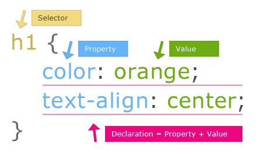
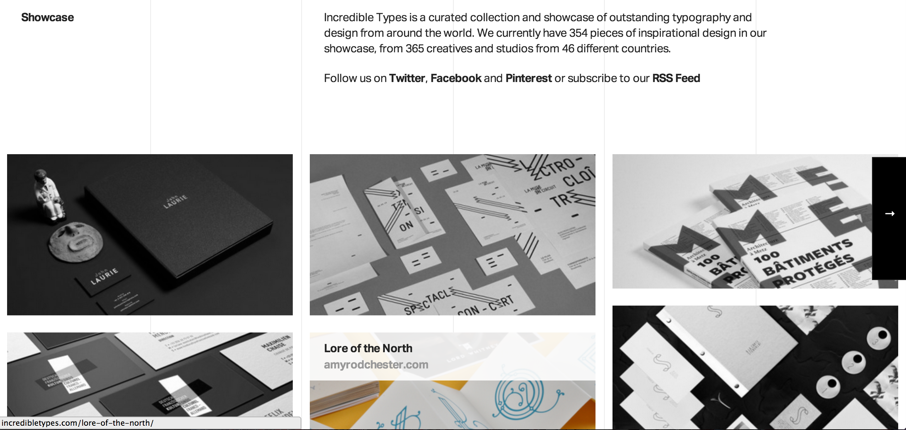

# Basics of HTML and CSS

##1. HTML

For an introduction to HTML please see [WebPlatform](http://docs.webplatform.org/wiki/html/tutorials).

W3C's HTML5 specification can be found here: [http://www.w3.org/TR/html5/](http://www.w3.org/TR/html5/)

Through the rest of this section you will create a basic HTML document. After finishing this section you will: 

* be able to create HTML documents that displays text, images, tables, lists
* understand how to structure HTML documents, and what the basic building blocks are
* understand best practices to write valid, accessible, and semantic HTML markup.

###Exercises

1. **The Basics of HTML:** 
	1. Create a basic `.html` file with a header displaying "Hello World".
	2. Change the `header` to "My todo list".
	3. Add a `list` of "todo items" for your daily chores.
	4. Create another `.html` file. Create a table for your expenses.
	5. Create another `.html` file. Add an image, a video, and a sound.
		* You may find this book useful: [http://diveintohtml5.info/](http://diveintohtml5.info/)		
	6. Create a "sign up" form with fields for: first name, last name, email, birthday, a dropdown to choose your favourite sport, and a text-area to include a small bio for the user. Add a button at the end to submit the form, and another one to clear the form. Add relevant validation rules for all fields (like required fields, valid email).
	7. Test your HTML files in at least Firefox, Chrome, IE, and Chrome for Android or iOS Safari.
2. **Doctypes & Metatags:** 
	1. Learn how to write valid, and semantic markup:
		* [HTML Validation](https://docs.webplatform.org/wiki/guides/html_validation)
		* [WHAT DOES IT ALL MEAN?](http://diveintohtml5.info/semantics.html)
	2. Add `doctype` to the previously created HTML documents. See what happens if you remove it.
	3. Add metatags to the document.
	4. Add the [meta viewport tag](http://www.quirksmode.org/mobile/metaviewport/). Check what happens in a mobile browser with or without it.
	4. Validate your markup: [W3C Validator](http://validator.w3.org/)
	5. Finally, check out [The HTML5 Boilerplate](https://github.com/h5bp/html5-boilerplate), to see a best-practice HTML document.
3. **Accessibility** 
	* Understand **why** accessibility is important:
		* [W3C Accessibility](http://www.w3.org/standards/webdesign/accessibility)
	* Understand **how** to make web document accessible:
		* [508 checklist](http://webaim.org/standards/508/checklist)
		* [BBC Accessibility Guideline](http://www.bbc.co.uk/guidelines/futuremedia/accessibility/html/).
		* [Leverage HTML5 features to improve accessibility](http://www.w3.org/Talks/2014/0317-HTML5-A11Y/)
		* [Accessibility: The Missing Ingredient](http://alistapart.com/article/accessibility-the-missing-ingredient)
	* **Validate** your markup to see if it is accessible:
		* Install a screen reader like [ChromeVox](https://chrome.google.com/webstore/detail/chromevox/kgejglhpjiefppelpmljglcjbhoiplfn?hl=en), and test your HTML document.
		* Install [Accessibility Developer Tools](https://chrome.google.com/webstore/detail/accessibility-developer-t/fpkknkljclfencbdbgkenhalefipecmb?hl=en), and perform an audit on your markup.

By now, you should have several `html` files with different examples of how to create lists, tables, add images, headers, etc. All the markup is syntactically valid, is semantic, passes the HTML validator, and is accessible.

## 2. CSS
In this section you will learn hot to use CSS to modify the look & feel, and the layout of HTML documents.

For a short introduction to HTML & CSS please go to: [http://learn.shayhowe.com/html-css/](http://learn.shayhowe.com/html-css/)

W3C's CSS specifications can be found [here](http://www.w3.org/TR/css-2010/).

### 2.1 Basics

Exercises

1. Create a basic [index.html](https://raw.githubusercontent.com/h5bp/html5-boilerplate/master/index.html) file (example provided).
2. Create an empty style.css file and link it to the index.html using [the link tag](https://developer.mozilla.org/en-US/docs/Web/HTML/Element/link#Examples).
3. Learn why is a best-practice to use a `reset stylesheet` [here](http://meyerweb.com/eric/tools/css/reset/). Then include [normalize.css](http://necolas.github.io/normalize.css/) before linking your style.css.
4. Add a basic page structure using HTML as depicted by the following picture:

### 2.2 Selectors and properties
Learn how to create CSS rules.

* [Brief of CSS selectors](http://www.sitepoint.com/web-foundations/css-selectors/)
* [CSS3 selectors sheet](http://www.w3.org/TR/css3-selectors/)
* Play a little [game](http://flukeout.github.io/) to consolidate your knowledge
* Bookmark the following list of properties for future reference [http://ref.openweb.io/CSS/](http://ref.openweb.io/CSS/)
* Bookmark a reference of CSS Vocabulary [http://pumpula.net/p/apps/css-vocabulary/](http://pumpula.net/p/apps/css-vocabulary/)
* 
Exercises:
    1. Add background to the header, footer, aside and nav.
    2. Add a global font definition (at html element) with a value of 14px, using a font-family you like.
    3. Center the header and footer text.

### 2.3 Specificity
Learn about CSS Specificity (basically how rules override one each others) [http://www.w3.org/TR/CSS21/cascade.html#specificity](http://www.w3.org/TR/CSS21/cascade.html#specificity)

Exercises:

1.	Experiment with specificity right now using CSS3 selectors [http://specificity.keegan.st/](http://specificity.keegan.st/)
2. Now add the following classes to the document created in section 2.1:
	* To &lt;header&gt;  add class .header
    * To &lt;footer&gt;  add class .footer
    * To &lt;section&gt;  add class .content
    * To &lt;nav&gt;  add class  .navigation
    * To &lt;aside&gt;  add class  .sidebar
3. Using the new added classes figure out how to override:
    * .header must have a font size of 46px
    * .footer must have a font size of 10px
    * .content must have a font size of 14px
    * .navigation must have a font size of 12px
    * .sidebar must have a font size of 10px
4. If the class attribute finish with **r (example header, footer)**, the background must be magenta.
5. If the class attribute contain an **a (example nav)** but do NOT finish with r, the background must be blue.
6. How could you add weight to the global font definition to win over the classes added by point 3?
7. Imagine there is a declaration like class=”oh-no-inline-styles” style=”background:red” and you need to change the background to green without changing the inline style. How could you accomplish this?

### 2.4 The Box Model
* Learn about the Box Model (how the browser calculate boxes size): [http://www.w3.org/TR/CSS21/box.html](http://www.w3.org/TR/CSS21/box.html)
* Experiment with the box-model here by changing width / margin / padding / box-sizing [http://dabblet.com/gist/2986528](http://dabblet.com/gist/2986528)
* Learn how to alter the box model calculations: [box-sizing](http://quirksmode.org/css/user-interface/boxsizing.html)
* More on [box-sizing](http://adamschwartz.co/magic-of-css/chapters/1-the-box/)
* Use the playground provided above to change *box-sizing* and see the changes.

### 2.5 Layout

#### 2.5.1 The display property
* Learn how to handle the display property (block, inline, inline-block, none) [http://learnlayout.com/display.html](http://learnlayout.com/display.html)
* Read about the display property [here](http://adamschwartz.co/magic-of-css/chapters/2-layout/)

Exercises

1. Now modify your CSS to reach something similar to the initial layout asked.

#### 2.5.2 Layout systems
* Learn how to create your own layout system [Grid Systems](http://www.adamkaplan.me/grid/)
* Learn hot to float elements [CSS Floats](http://alistapart.com/article/css-floats-101)
* Learn about [CSS units](http://alistapart.com/article/love-the-boring-bits-of-css)
* Using your own layout system, implement the following page (only desktop).
  
* When the user **:hover** the right side black box (observe at middle right of the screenshot) it must show a “hello world” message and go back when move the mouse out. To accomplish this [Learn about CSS position](http://learnlayout.com/position.html).

### 2.6 Media queries
* [Learn Media Queries](http://css-tricks.com/css-media-queries/) and adapt your previous exercises to work on mobile screens. Use the following design as guide [example](http://mediaqueri.es/ity/).
